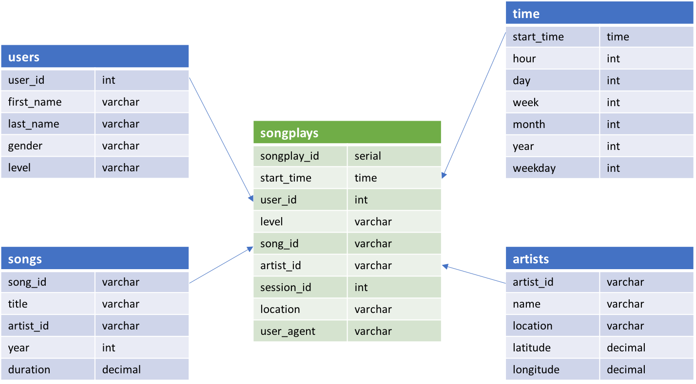

## Project Overview

This project is an excercise for building data warehouse and ETL pipeline using AWS. Fact and dimension tables for a star schema is defined. The ETL pipeline is written to first load data from S3 to staging tables on Redshift, then execute SQL statements that create the analytics tables from these staging tables.

The dataset is a simulated dataset of a spotify-like startup. It includes songplay logs, song details and artist details. The data is modeled using a star scheme, with 1 fact table "songplays" and 4 dimension tables "users", "songs", "artists" and "time".

## How to Run:
- configure a redshift cluster on AWS
- provide Cluster information and IAM Role in config file dwh.cfg
- run create_tables.py to initialize (or drop previous) database and create empty tables
- run etl.py to utilize etl pipeline to extra data from S3 buckets to database

## Files Description:
- create_tables.py: drops existing database and tables, and creates new database and tables;
- etl.py: a etl pipeline that extracts data from S3 buckets to redshift and create 2 staging tables and 5 final tables: songplays, users, songs, artists and time;
- dwh.cfg: config file containing information to access S3 buckets and redshift cluster

## Schema for Song Play Analysis

### Fact Table
Table: "songplays" - records in log data associated with song plays
- Columns: songplay_id, start_time, user_id, level, song_id, artist_id, session_id, location, user_agent

### Dimension Tables
Table: "users" - users in the app
- Columns: user_id, first_name, last_name, gender, level

Table: "songs" - songs in music database
- Columns: song_id, title, artist_id, year, duration

Table: "artists" - artists in music database
- Columns: artist_id, name, location, latitude, longitude

Table: "time" - timestamps of records in songplays broken down into specific units
- Columns: start_time, hour, day, week, month, year, weekday

## Acknowledgement 

Credits to Udacity for the templates.
